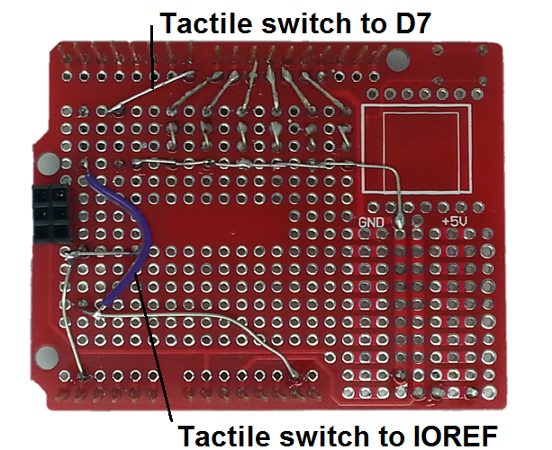

## Coding Shield Project

The Coding Shield Project is inspired by the

[ThinkerShield](https://maas.museum/product/thinkershield/), which has been developed by the [Museum of Applied Arts and Sciences](https://maas.museum/) as a tool for teaching coding. The ThinkerShield is even used in a unit of work for Year 7 and 8 students called ‘Crack the Code’. However you might use it, the Coding Shield is a board that allows students to learn software coding without having to worry about the hardware.

Being a project, there’s still some construction needed, but it’s a project that an older sibling or relative can build for a younger person, or would even make a great assignment for an electrotechnology class, with the finished Coding Shields available to a coding class.

The Coding Shield gives you six LED’s, a piezo transducer, a pushbutton, an LDR and a potentiometer all wired into an Arduino Prototyping Shield. The Coding Shield can then be pushed onto an Arduino main board and used for coding without having to worry about wiring things up.

## Shopping List

|Qty| Code | Description |
|---|---|---|
|1 | [XC4410](http://jaycar.com.au/p/XC4410) | UNO
|1 | [XC4482](http://jaycar.com.au/p/XC4482) | prototyping shield
|7 | [ZD0120](http://jaycar.com.au/p/ZD0120) | green 3mm LED
|1 | [AB3440](http://jaycar.com.au/p/AB3440) | Piezo transducer
|1 | [SP0601](http://jaycar.com.au/p/SP0601) | Tactile switch
|1 | [RD3485](http://jaycar.com.au/p/RD3485) | LDR
|1 | [RP8510](http://jaycar.com.au/p/RP8510) | 10kohm potentiometer
|1 | [RR0564](http://jaycar.com.au/p/RR0564) | 470 resistors
|1 | [RR0572](http://jaycar.com.au/p/RR0572) | 1k resistors
|1 | [RR0596](http://jaycar.com.au/p/RR0596) | 10k resistors

You might also need some short offcuts of wire.

## Layout

To help guide you in assembling the Coding Shield, it helps to know what everything will connect to. Here is an overview:

|Pin|Component|Notes
|---|---|---
|D3|Piezo Transducer|Negative terminal to GND
|D7|Switch|D7 is held low by a 10K Ohm resistor to ground, and connected to 5V when switch is pressed.
|D8|LED|Cathode to GND via 470 Ohm resistor.
|D9|LED|Cathode to GND via 470 Ohm resistor.
|D10|LED|Cathode to GND via 470 Ohm resistor.
|D11|LED|Cathode to GND via 470 Ohm resistor.
|D12|LED|Cathode to GND via 470 Ohm resistor.
|D13|LED|Cathode to GND via 470 Ohm resistor.
|A4|LDR|LDR sits between 5V and A4 creating a voltage divider with a 1 kOhm resistor between A4 and GND.
|A5|Potentiometer|Set up as a voltage divider between 5V and GND with wiper connected to A5.
|5V|Power LED|Cathode to GND via 470 Ohm resistor.
The above guide is also useful for when you are writing sketches as well, as you know what pins correspond to what functions on the board.

## Construction

To help build some of the ‘links’ on the Coding Shield, we use the legs of the components, so be careful not to cut the legs except where noted. It’s possible to solder them on afterwards, but it’s usually easier to not cut them.

Start by getting out the LED’s, and solder onto the Prototyping Shield as shown, making sure that the cathodes (short leg with flat on body) is furthest from the digital pin side (facing the bottom of the board). The power LED at bottom left has the cathode to the left. The leftmost top LED is in the top left hole.

Solder the legs in place, then bend the anodes (closest to the top) over and solder them to D8-D13, then trim.

Take six of the 470 Ohm resistors, and bend one leg by 180 degrees:

Then insert them in the holes directly below the top LED’s, and solder in place. Take a seventh resistor, and wire it between the power LED and GND as shown. Both legs can be trimmed on the power LED resistor.

Before trimming the other resistors, bend and join the leg closest to the LED, and then bend and join the other legs until they form a continuous wire that connects to GND.

The next components to install are the Tactile Switch, LDR and 1k Ohm resistor. As for the others, solder in place, but do not trim the legs right away.

The first thing to do on the other side is to run the bottom-most leg of the LDR to the IOREF pin, and the topmost leg to A4. For the resistor, run one leg to the GND bus made up of the LED legs, and connect the other leg to the LDR leg that goes to A4. This means that we have a voltage divider between IOREF and GND feeding its output into A4.

Using an offcut of resistor leg (as we have below) or a piece of wire, link one corner of the tactile switch to pin D7, and the opposite corner to the wire connecting to IOREF.

The potentiometer is next, bend the legs downwards so that they protrude below its body.

Then mount the potentiometer on the board, making sure that the legs are to the left. We’re going to connect the bottom-most pin to the IOREF wire, so try to line this up if possible. You can also take one of the 10kOhm resistor, and connect it between D7 and GND above the LED’s. This ensures that the input of D7 is held low and doesn’t float.

On the reverse of the board, solder the bottom-most pin to IOREF, then run a wire from the middle pin to A5, and from the top pin to GND (we used a resistor leg for this).

The last solder step is the piezo transducer, which has its red lead connected to D3, and its black lead connected to GND. The leads are quite long, so you might like to trim them before soldering. We used super glue to affix the transducer into the position seen below, but you might want to leave this until you’ve tested the board.

## Testing

To start testing, connect the Coding Shield to an Uno (it should work with any other Arduino compatible board too), and connect the Uno to power. The power LED should light up and the leftmost D13 LED will flicker and go off. Apart from that, you won’t see much. We’ve developed a test sketch that will test all the features of the shield.

You can either copy and paste the code from the end of this document, or find it in the attached resource file. Like any other sketch, the correct board is selected from the Tools menu, the serial port is selected, and then the sketch is uploaded. To check the output, open the Serial Monitor at 115200 baud.

The sketch uses some defines to give the pins friendly names- this is not necessary, but can make it easier to write the sketch. The code cycles through the six LED’s and then sounds a tone, and at the same time displays the input statuses on the Serial Monitor. If the LED’s flash out of order, or something else doesn’t seem to respond to input as it should, then you might have a wiring error. The easiest way to trace is to following the wiring of the individual component that doesn’t seem to be doing the right thing.

## What’s Next

There are some great project guides and even some sample code available on the MAAS website, check out the **FREE DOWNLOADS AND RESOURCES** section of this page:
[maas.museum/learn/thinkershield](https://maas.museum/learn/thinkershield/)
